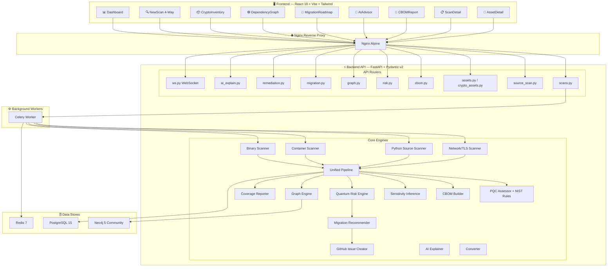
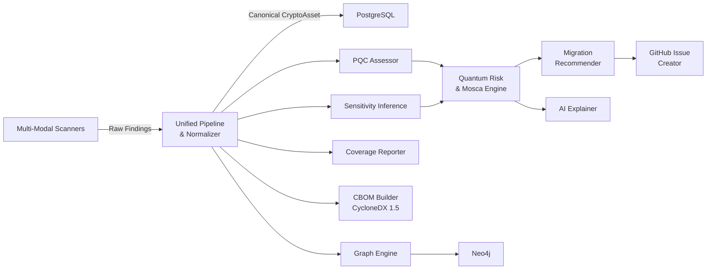

# 🛡️ CipherSight — Architecture & Implementation Status

## High-Level Architecture



---

## Data Flow Pipeline



---

## Directory Structure

```
cyphercite/
├── .env / .env.example                   # Environment config
├── docker-compose.yml                    # 7 services: db, redis, neo4j, backend, worker, frontend, nginx
├── README.md
├── ARCHITECTURE.md                       # ← This file
├── IMPLEMENTATION_PLAN.md                # Phase-by-phase build plan
├── docs/
│   └── crypto-asset-model.md             # CryptoAsset data model doc
├── backend/
│   ├── Dockerfile
│   ├── requirements.txt                  # 20+ Python deps
│   ├── alembic/ + alembic.ini            # DB migrations
│   ├── pytest.ini
│   ├── tests/                            # 17 test files, 128+ tests
│   │   ├── conftest.py                   # Async test fixtures
│   │   ├── fixtures/                     # Sample crypto code for testing
│   │   ├── test_python_scanner.py
│   │   ├── test_github_repo_fetcher.py
│   │   ├── test_container_scanner.py
│   │   ├── test_binary_scanner.py
│   │   ├── test_unified_pipeline.py
│   │   ├── test_sensitivity_engine.py
│   │   ├── test_graph_engine.py
│   │   ├── test_quantum_risk_engine.py
│   │   ├── test_migration_recommender.py
│   │   ├── test_github_issue_creator.py
│   │   ├── test_ai_explainer.py
│   │   ├── test_cbom_generation.py
│   │   ├── test_coverage.py
│   │   ├── test_e2e_platform.py
│   │   └── test_crypto_assets.py
│   └── app/
│       ├── main.py                       # FastAPI entry point
│       ├── config.py                     # pydantic-settings config
│       ├── database.py                   # Async SQLAlchemy + PostgreSQL
│       ├── models/                       # 5 ORM models
│       │   ├── scan.py                   # ScanJob
│       │   ├── asset.py                  # Network Asset
│       │   ├── crypto_asset.py           # CryptoAsset (30+ fields, canonical finding)
│       │   ├── cbom.py                   # CBOMRecord
│       │   └── certificate.py            # PQCCertificate
│       ├── schemas/                      # Pydantic v2 schemas
│       │   ├── scan.py
│       │   ├── asset.py
│       │   ├── crypto_asset.py
│       │   ├── cbom.py
│       │   ├── coverage.py
│       │   └── ai.py
│       ├── routers/                      # 12 API routers
│       │   ├── scans.py                  # Network scan CRUD
│       │   ├── source_scan.py            # Source, GitHub, container, binary scan endpoints
│       │   ├── assets.py                 # Network asset endpoints
│       │   ├── crypto_assets.py          # Unified finding CRUD
│       │   ├── cbom.py                   # CBOM JSON/CSV/PDF export
│       │   ├── risk.py                   # Quantum risk & Mosca
│       │   ├── graph.py                  # Topology graph
│       │   ├── migration.py              # P0–P3 roadmap
│       │   ├── remediation.py            # GitHub issue preview/publish
│       │   ├── ai_explain.py             # AI explainer & Q&A
│       │   ├── certificates.py           # PQC badges
│       │   └── ws.py                     # WebSocket progress
│       ├── tasks/                        # Celery background tasks
│       │   ├── celery_app.py
│       │   └── scan_tasks.py             # Full pipeline orchestration
│       └── core/                         # Core business logic engines
│           ├── converter.py              # Asset → CryptoAsset bridge
│           ├── scanner/                  # Network scanners
│           │   ├── discovery.py          # DNS, subdomain enum, port scan, CIDR
│           │   ├── tls_inspector.py      # TLS 1.2/1.3 fingerprinting
│           │   ├── vpn_detector.py       # VPN detection
│           │   └── api_prober.py         # HTTP/HTTPS API detection
│           ├── source_scanner/           # Python source code analysis
│           │   ├── __init__.py           # GitHub repo fetcher + orchestration
│           │   ├── python_scanner.py     # AST-based crypto detection
│           │   └── rules/
│           │       ├── __init__.py
│           │       └── python_rules.py   # Detection rule configs
│           ├── container_scanner/        # Container image analysis
│           │   ├── scanner.py            # Daemonless OCI scanner
│           │   ├── package_parser.py     # dpkg/rpm/apk parsing
│           │   └── rules.py             # Crypto library rules
│           ├── binary_scanner/           # Compiled binary analysis
│           │   ├── scanner.py            # ELF/PE/Mach-O scanner
│           │   ├── format_parser.py      # Binary format parsers
│           │   └── signatures.py         # Crypto symbol signatures
│           ├── pipeline/                 # Unified scan pipeline
│           │   ├── pipeline.py           # Multi-scanner orchestration
│           │   └── normalizer.py         # Canonical algorithm normalization
│           ├── pqc/                      # Post-quantum assessment
│           │   ├── assessor.py           # Risk scoring (0–100)
│           │   ├── nist_rules.py         # FIPS 203/204/205 mappings
│           │   └── classifier.py         # Severity classification
│           ├── cbom/                     # CycloneDX CBOM generation
│           │   ├── builder.py            # CycloneDX 1.5 JSON
│           │   ├── exporter.py           # CSV export
│           │   └── pdf_report.py         # PDF via ReportLab
│           ├── sensitivity/              # Data sensitivity inference
│           │   └── inference.py          # Contextual tokenizer
│           ├── coverage/                 # Scan coverage tracking
│           │   └── reporter.py           # Files scanned/skipped/confidence
│           ├── graph/                    # Cryptographic topology graph
│           │   ├── engine.py             # App→File→Algorithm→Data graph
│           │   └── models.py             # Node/edge data classes
│           ├── risk/                     # Quantum risk assessment
│           │   ├── quantum_risk.py       # Mosca theorem, multi-factor scoring
│           │   └── knowledge_base/
│           │       └── algorithms.yaml   # Hot-reloadable algo definitions
│           ├── migration/                # Migration recommendations
│           │   └── recommender.py        # P0–P3 prioritized roadmap
│           ├── github/                   # GitHub integration
│           │   ├── issue_creator.py      # Markdown issue templates
│           │   └── repository_fetcher.py # Zipball extraction + git clone
│           ├── ai/                       # AI explanation agent
│           │   └── explainer.py          # Shor/Grover math, qubit estimates, Q&A
│           ├── certificate/              # PQC badge + QR generation
│           └── __init__.py
├── frontend/
│   ├── Dockerfile
│   ├── package.json                      # React 18 + Vite + Tailwind
│   ├── vite.config.js
│   ├── tailwind.config.js
│   └── src/
│       ├── App.jsx                       # React Router setup
│       ├── main.jsx                      # Entry + QueryClient
│       ├── index.css                     # Tailwind + glassmorphism theme
│       ├── api/
│       │   └── client.js                 # Axios API client
│       ├── hooks/
│       │   ├── useScanSocket.js          # WebSocket hook
│       │   └── useScanResults.js         # Scan results hook
│       ├── pages/
│       │   ├── Dashboard.jsx             # Executive stats & heatmaps
│       │   ├── NewScan.jsx               # 4-way scan (Network/Source/Container/Binary)
│       │   ├── CryptoInventory.jsx       # Canonical findings catalog
│       │   ├── DependencyGraph.jsx       # SVG topology visualization
│       │   ├── MigrationRoadmap.jsx      # P0–P3 roadmap cards
│       │   ├── AIAdvisor.jsx             # Q&A, analyzer, executive summary
│       │   ├── CBOMReport.jsx            # CycloneDX viewer + downloads
│       │   ├── ScanDetail.jsx            # Per-scan breakdown
│       │   └── AssetDetail.jsx           # Single asset deep view
│       └── components/
│           ├── AssetTable.jsx
│           ├── CertCard.jsx
│           ├── CipherChart.jsx
│           ├── PQCBadge.jsx
│           ├── RiskHeatmap.jsx
│           └── ScanProgress.jsx
└── nginx/
    └── nginx.conf                        # Reverse proxy config
```

---

## Backend Module Inventory

### Scanners

| Module | Path | LOC | Notes |
|--------|------|-----|-------|
| **Network/TLS Discovery** | `backend/app/core/scanner/discovery.py` | 628 | DNS, subdomain enum (crt.sh, HackerTarget, CertSpotter, AlienVault), port scanning, CIDR expansion |
| **TLS Inspector** | `backend/app/core/scanner/tls_inspector.py` | 346 | TLS 1.2/1.3, cipher suites, certificate DER decoding |
| **VPN Detector** | `backend/app/core/scanner/vpn_detector.py` | 136 | Port + TLS cert analysis |
| **API Prober** | `backend/app/core/scanner/api_prober.py` | 133 | HTTP/HTTPS detection + security headers |
| **Python Source Scanner** | `backend/app/core/source_scanner/python_scanner.py` | 16,850 | AST-based: `cryptography`, `PyCryptodome`, `hashlib`, `hmac`, `ssl` |
| **Source Scanner Init** | `backend/app/core/source_scanner/__init__.py` | 6,574 | GitHub repo fetcher + orchestration |
| **Container Scanner** | `backend/app/core/container_scanner/scanner.py` | 16,492 | Daemonless OCI, dpkg/rpm/apk |
| **Container Package Parser** | `backend/app/core/container_scanner/package_parser.py` | 4,920 | OS package db parsing |
| **Container Rules** | `backend/app/core/container_scanner/rules.py` | 10,688 | Crypto library detection rules |
| **Binary Scanner** | `backend/app/core/binary_scanner/scanner.py` | 15,346 | Pure-Python ELF/PE/Mach-O |
| **Binary Format Parser** | `backend/app/core/binary_scanner/format_parser.py` | 20,349 | ELF/PE/Mach-O format parsers |
| **Binary Signatures** | `backend/app/core/binary_scanner/signatures.py` | 26,512 | Crypto symbol/function signatures |

### Core Engines

| Module | Path | LOC | Notes |
|--------|------|-----|-------|
| **Unified Pipeline** | `backend/app/core/pipeline/pipeline.py` | 4,649 | Orchestrates all scanners → unified output |
| **Normalizer** | `backend/app/core/pipeline/normalizer.py` | 9,614 | Canonical algorithm normalization |
| **Converter** | `backend/app/core/converter.py` | 3,064 | Asset → CryptoAsset bridge |
| **PQC Assessor** | `backend/app/core/pqc/assessor.py` | 324 | Rule-based risk scoring (0–100), status classification |
| **NIST Rules** | `backend/app/core/pqc/nist_rules.py` | 185 | FIPS 203/204/205 algorithm mappings |
| **PQC Classifier** | `backend/app/core/pqc/classifier.py` | 122 | Severity level classification |
| **CBOM Builder** | `backend/app/core/cbom/builder.py` | 227 | CycloneDX 1.5 JSON generation |
| **CBOM Exporter** | `backend/app/core/cbom/exporter.py` | ~100 | CSV export |
| **PDF Report** | `backend/app/core/cbom/pdf_report.py` | ~200 | PDF via ReportLab |
| **Sensitivity Inference** | `backend/app/core/sensitivity/inference.py` | 11,312 | Contextual tokenizer, sensitivity class hierarchy |
| **Coverage Reporter** | `backend/app/core/coverage/reporter.py` | 8,522 | Files scanned/skipped, confidence tracking |
| **Graph Engine** | `backend/app/core/graph/engine.py` | 9,188 | App→File→Algorithm→Data graph modeling |
| **Quantum Risk Engine** | `backend/app/core/risk/quantum_risk.py` | 8,714 | Mosca theorem, multi-factor scoring (0–100) |
| **Algorithm Knowledge Base** | `backend/app/core/risk/knowledge_base/algorithms.yaml` | 3,542 | Hot-reloadable algorithm definitions |
| **Migration Recommender** | `backend/app/core/migration/recommender.py` | 8,398 | P0–P3 prioritized roadmap + code snippets |
| **GitHub Issue Creator** | `backend/app/core/github/issue_creator.py` | 4,318 | Markdown issue templates + REST publish |
| **GitHub Repo Fetcher** | `backend/app/core/github/repository_fetcher.py` | 8,012 | Zipball extraction + git clone fallback |
| **AI Explainer** | `backend/app/core/ai/explainer.py` | 36,259 | Shor/Grover math, qubit estimates, Q&A |

### Database Models

| Model | Table | Fields | Purpose |
|-------|-------|--------|---------|
| **ScanJob** | `scan_jobs` | id, target, status, scan_depth, created_at, completed_at, total_assets, quantum_safe_count, vulnerable_count, hybrid_count, error_message | Top-level scan job |
| **Asset** | `assets` | id, scan_id, hostname, ip_address, port, service_type, tls_versions, cipher_suites, certificate, key_exchange, pqc_status, risk_score, vulnerabilities, recommendations | Network TLS endpoint |
| **CryptoAsset** | `crypto_assets` | 30+ fields covering identity, crypto properties, library, source-code provenance, network info, PQC status, business-risk, confidence, evidence, sensitivity, primitive, mode, padding, usage, quantum_status, metadata | **Unified canonical finding** |
| **CBOMRecord** | `cbom_records` | id, scan_id, cyclonedx_json | Stores generated CycloneDX CBOM |
| **PQCCertificate** | `pqc_certificates` | id, asset_id, cert_id, status, algorithms_verified, fingerprint, badge paths | PQC readiness badge |

### API Endpoints

#### Scans & Discovery
| Method | Path | Router | Purpose |
|--------|------|--------|---------|
| `POST` | `/api/scans` | `scans.py` | Submit network TLS scan |
| `GET` | `/api/scans` | `scans.py` | List scans (paginated) |
| `GET` | `/api/scans/{id}` | `scans.py` | Get scan details |
| `GET` | `/api/scans/dashboard` | `scans.py` | Dashboard stats |
| `POST` | `/api/scan/source` | `source_scan.py` | Submit source code scan |
| `POST` | `/api/scan/github` | `source_scan.py` | Submit GitHub repo scan |
| `GET` | `/api/scan/github/info` | `source_scan.py` | Fetch GitHub repo metadata |
| `POST` | `/api/scan/container` | `source_scan.py` | Submit container image scan |
| `POST` | `/api/scan/binary` | `source_scan.py` | Submit binary scan |
| `GET` | `/api/scan/{id}` | `source_scan.py` | Get scan results |
| `GET` | `/api/scan/{id}/coverage` | `source_scan.py` | Get coverage metrics |

#### Canonical Findings & CBOM
| Method | Path | Router | Purpose |
|--------|------|--------|---------|
| `GET/POST` | `/api/crypto-assets` | `crypto_assets.py` | CRUD for unified crypto findings |
| `GET` | `/api/crypto-assets/{id}` | `crypto_assets.py` | Get single crypto asset |
| `GET` | `/api/assets` | `assets.py` | List network assets |
| `GET` | `/api/cbom/{scan_id}` | `cbom.py` | Generate CBOM (JSON/CSV/PDF) |

#### Graph, Risk & Migration
| Method | Path | Router | Purpose |
|--------|------|--------|---------|
| `GET` | `/api/graph/{scan_id}` | `graph.py` | Topology graph for a scan |
| `GET` | `/api/graph` | `graph.py` | Global cross-scan graph |
| `GET` | `/api/risk/scan/{scan_id}` | `risk.py` | Quantum risk & Mosca |
| `POST` | `/api/risk/evaluate` | `risk.py` | Ad-hoc risk evaluation |
| `GET` | `/api/migration/plan/{scan_id}` | `migration.py` | P0–P3 migration roadmap |
| `POST` | `/api/migration/recommend` | `migration.py` | Ad-hoc recommendation |

#### Remediation & AI
| Method | Path | Router | Purpose |
|--------|------|--------|---------|
| `GET` | `/api/remediation/finding/{id}/issue-preview` | `remediation.py` | GitHub issue markdown |
| `GET` | `/api/remediation/scan/{id}/export-issues` | `remediation.py` | Export all issues as JSON |
| `POST` | `/api/remediation/publish` | `remediation.py` | Publish to GitHub |
| `POST` | `/api/ai/explain` | `ai_explain.py` | Deep-dive finding explanation |
| `GET` | `/api/ai/finding/{id}` | `ai_explain.py` | Get explanation by UUID |
| `GET` | `/api/ai/scan/{id}/summary` | `ai_explain.py` | Executive summary |
| `POST` | `/api/ai/query` | `ai_explain.py` | Natural language Q&A |

#### Other
| Method | Path | Router | Purpose |
|--------|------|--------|---------|
| `GET` | `/api/certificates/{id}` | `certificates.py` | PQC certificate/badge |
| `WS` | `/api/ws/scan/{id}` | `ws.py` | Real-time scan progress |
| `GET` | `/api/health` | `main.py` | Health check |

---

## Test Suite (17 test files, 128+ tests)

| Test File | Covers |
|-----------|--------|
| `test_python_scanner.py` | Source code AST scanner & detection rules |
| `test_github_repo_fetcher.py` | GitHub repository fetcher, zipball extraction & API |
| `test_container_scanner.py` | Container image package & binary parsers |
| `test_binary_scanner.py` | Compiled binary ELF/PE/Mach-O parsers |
| `test_unified_pipeline.py` | Unified pipeline & canonical normalizer |
| `test_sensitivity_engine.py` | Sensitivity inference & tokenization |
| `test_graph_engine.py` | Cryptographic topology graph engine |
| `test_quantum_risk_engine.py` | Quantum risk & Mosca theorem calculations |
| `test_migration_recommender.py` | Migration recommender & code templates |
| `test_github_issue_creator.py` | GitHub issue creator & REST publishing |
| `test_ai_explainer.py` | AI explanation agent & Q&A router |
| `test_cbom_generation.py` | CycloneDX CBOM builder & exports |
| `test_coverage.py` | Coverage reporter |
| `test_e2e_platform.py` | End-to-end full platform integration |
| `test_crypto_assets.py` | Crypto asset model & API tests |

---

## Frontend Architecture

### Technology Stack

| Aspect | Technology |
|--------|------------|
| Framework | React 18 (JSX) |
| Build Tool | Vite 6 |
| Styling | Tailwind CSS 3.4 + custom Glassmorphism theme |
| State Management | TanStack React Query v5 |
| Routing | React Router v6 |
| HTTP Client | Axios |
| Charting | Recharts |
| Real-time | WebSocket via custom hooks |
| Notifications | react-hot-toast |
| Code Display | react-syntax-highlighter |

### Pages (9)

| Page | Route | Description |
|------|-------|-------------|
| **Dashboard** | `/` | Executive statistics, quantum readiness ratios, risk heatmaps |
| **NewScan** | `/scan/new` | 4-way multi-modal scanner (Network, Source, Container, Binary) |
| **CryptoInventory** | `/inventory` | Searchable findings catalog with filtering, inline AI, GitHub issue modals |
| **DependencyGraph** | `/graph` | Interactive SVG topology visualization with zoom, pan, inspector |
| **MigrationRoadmap** | `/roadmap` | Prioritized P0–P3 roadmap cards with code snippet viewers |
| **AIAdvisor** | `/ai` | Q&A chat console, custom primitive analyzer, executive summary |
| **CBOMReport** | `/cbom/:scanId` | CycloneDX viewer + 1-click JSON, CSV, PDF downloads |
| **ScanDetail** | `/scan/:scanId` | Per-scan breakdown, coverage metrics, findings table |
| **AssetDetail** | `/asset/:assetId` | Single asset deep-dive view |

### Reusable Components (6)

| Component | Purpose |
|-----------|---------|
| `AssetTable` | Tabular display of crypto assets with sorting |
| `CertCard` | Certificate information card |
| `CipherChart` | Recharts-based cipher suite visualization |
| `PQCBadge` | Post-quantum status indicator badge |
| `RiskHeatmap` | Risk distribution heatmap |
| `ScanProgress` | Real-time scan progress indicator |

---

## Infrastructure & Deployment

### Docker Compose Services (7)

| Service | Container | Port | Description |
|---------|-----------|------|-------------|
| **Frontend** | `ciphersight-frontend` | `3000` | React Web UI |
| **Backend** | `ciphersight-backend` | `8000` | FastAPI REST & WebSocket API |
| **Nginx** | `ciphersight-nginx` | `80` | Unified reverse proxy |
| **PostgreSQL** | `ciphersight-db` | `5433` | Primary relational store |
| **Redis** | `ciphersight-redis` | `6379` | Task broker & result backend |
| **Neo4j** | `ciphersight-neo4j` | `7474` | Graph database |
| **Celery** | `ciphersight-worker` | Internal | Background scan worker |

---

## Implementation Status Summary

| Category | Total | Implemented | Status |
|----------|-------|-------------|--------|
| Backend Scanners | 4 types | 4 | ✅ Complete |
| Core Engines | 10 engines | 10 | ✅ Complete |
| Database Models | 5 models | 5 | ✅ Complete |
| API Routers | 12 routers | 12 | ✅ Complete |
| Test Files | 17 files | 17 | ✅ Complete |
| Frontend Pages | 9 pages | 9 | ✅ Complete |
| Frontend Components | 6 components | 6 | ✅ Complete |
| Infrastructure | Docker/Nginx/Alembic | All | ✅ Complete |

---

## Remaining Work

| Item | Status | Description |
|------|--------|-------------|
| **Neo4j Live Sync** | ⚠️ Pending | Graph engine works in-memory; Neo4j driver + Cypher query sync not yet wired |
| **Alembic Migrations** | ⚠️ Pending | Initialized but migration revisions for extended CryptoAsset schema need generation |
| **Authentication** | ⚠️ Pending | JWT deps exist (`python-jose`, `passlib`) but auth not wired to routes |
| **TypeScript Migration** | ⚠️ Pending | All frontend pages are JSX; incremental TSX migration planned |
| **E2E Deployment Test** | ⚠️ Pending | Full 7-service Docker stack smoke test |
| **Frontend API Integration** | ⚠️ Pending | Real API call validation from UI pages |
| **WebSocket All Scan Types** | ⚠️ Pending | Progress broadcasting for source/container/binary scans |
| **Error Handling** | ⚠️ Pending | Edge cases: invalid PATs, corrupt binaries, malformed tarballs |
